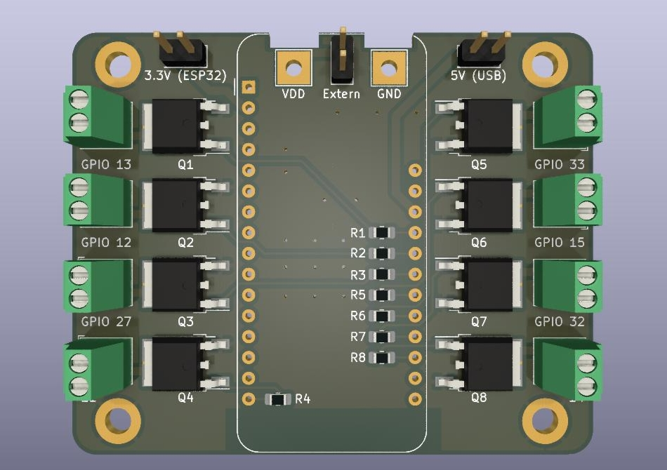

# MOSFEaTher

This PCB provides control of eight MOSFET outputs. These can be controlled through an [Adafruit Feather HUZZAH32](https://www.adafruit.com/product/3405) microcontroller. It is a two-layer PCB and all parts can be handsoldered in case that costs are a concern.

This board was designed using [KiCad 6.0](http://www.kicad.org).

## Design

## Parts
The board requires the following parts. All of them should be easy to handsolder:

Part                   | Quantity | Description
-----------------------|----------|----------------------------
Feather HUZZAH32       | 1        | ESP32 Microcontroller
Phoenix MPT-0,5-2-2.54 | 8        | 2-pin Terminalblock
IRLR024N DPAK MOSFET   | 8        | N-Channel MOSFET (55V 17A)
0805 Resistor 470 Ohm  | 8        | Generic Resistor

## License
 This work is licensed under a <a rel="license" href="http://creativecommons.org/licenses/by/4.0/">Creative Commons Attribution 4.0 International License</a>.
